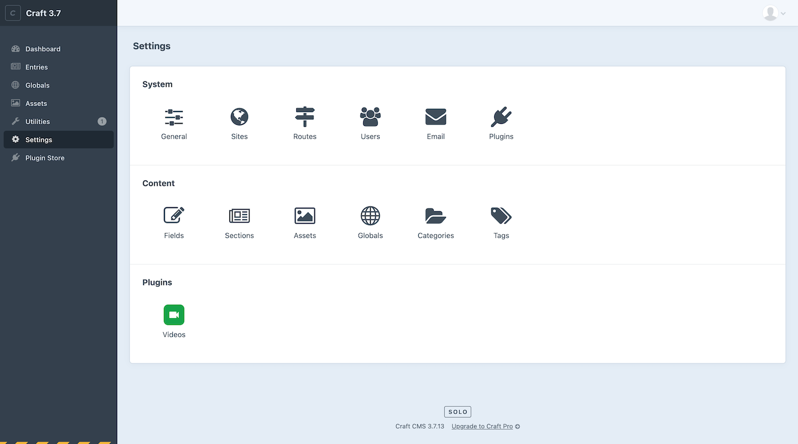
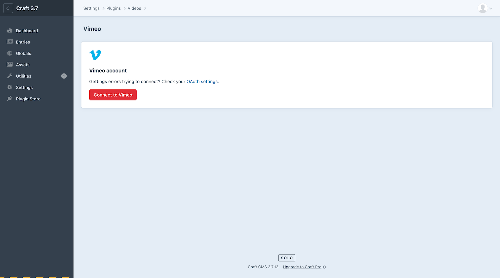
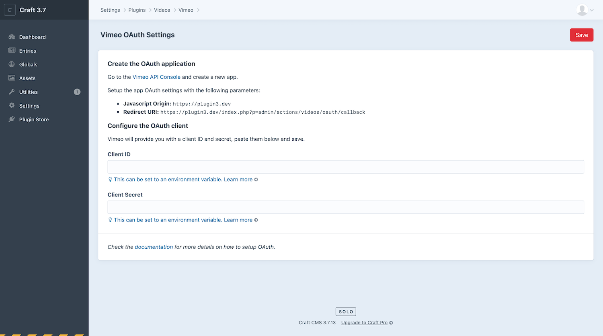
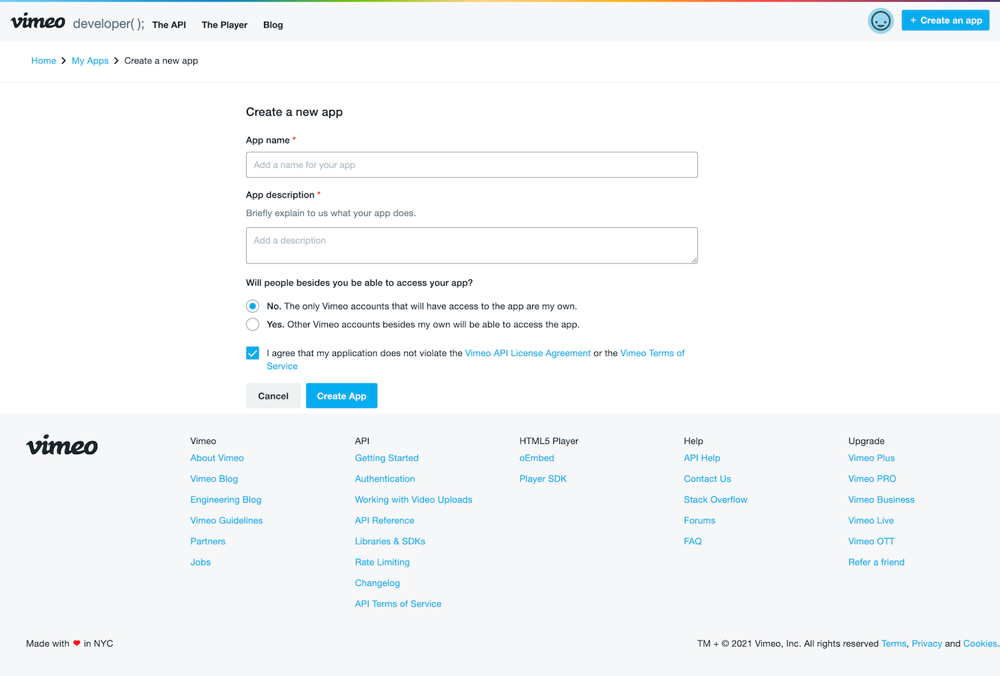
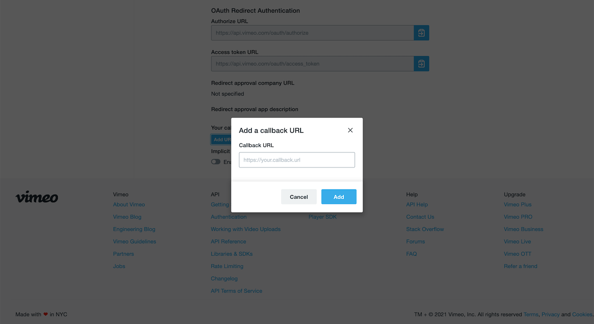
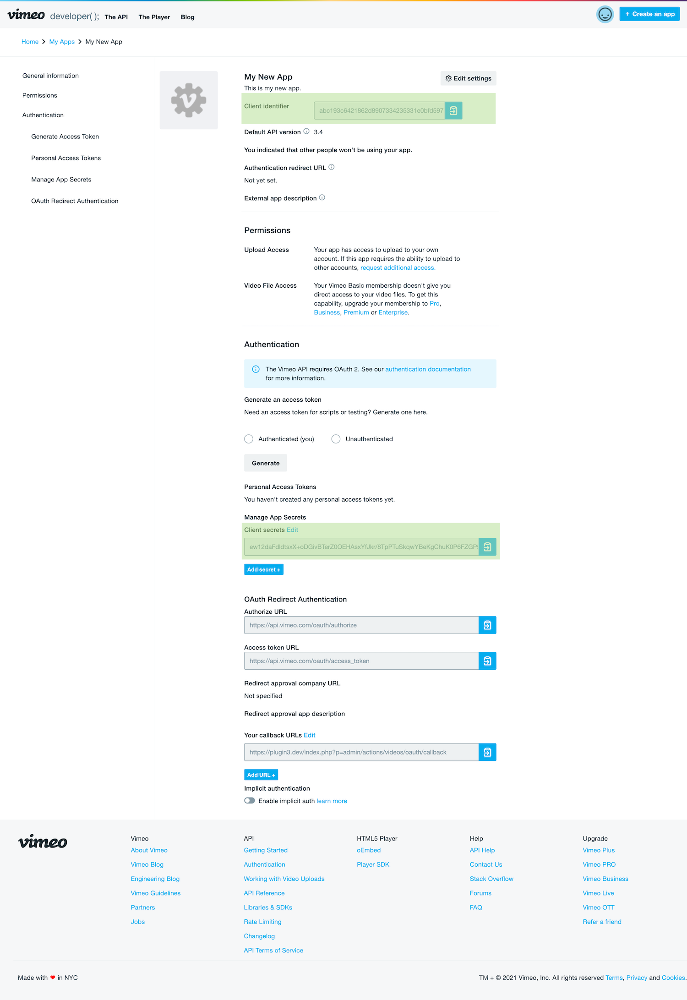
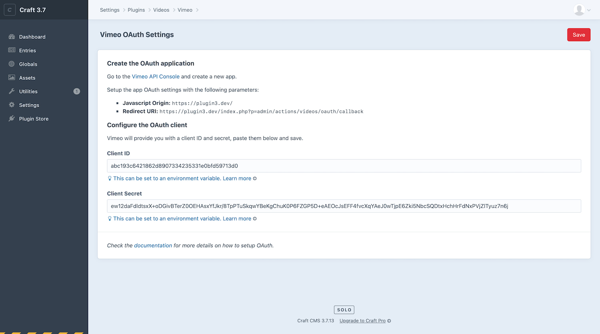
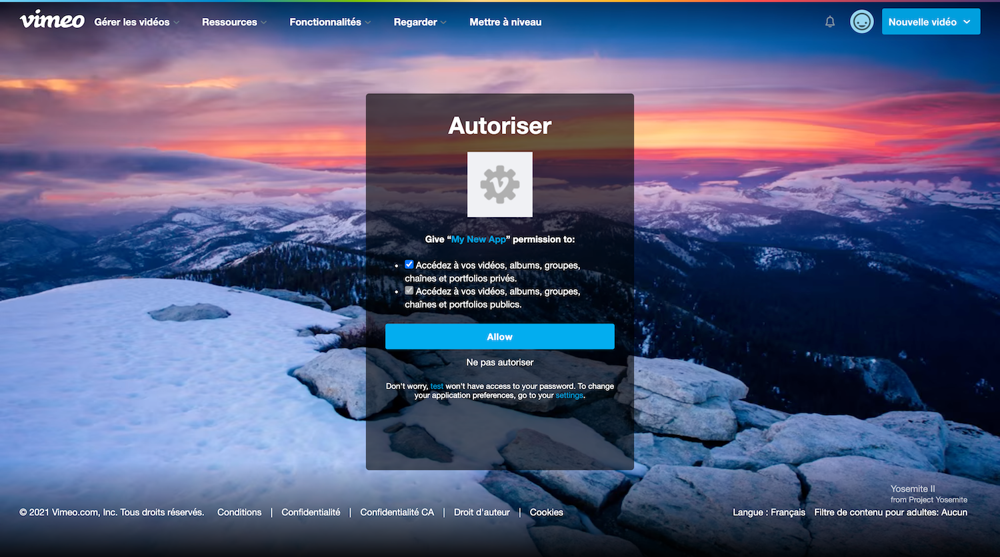
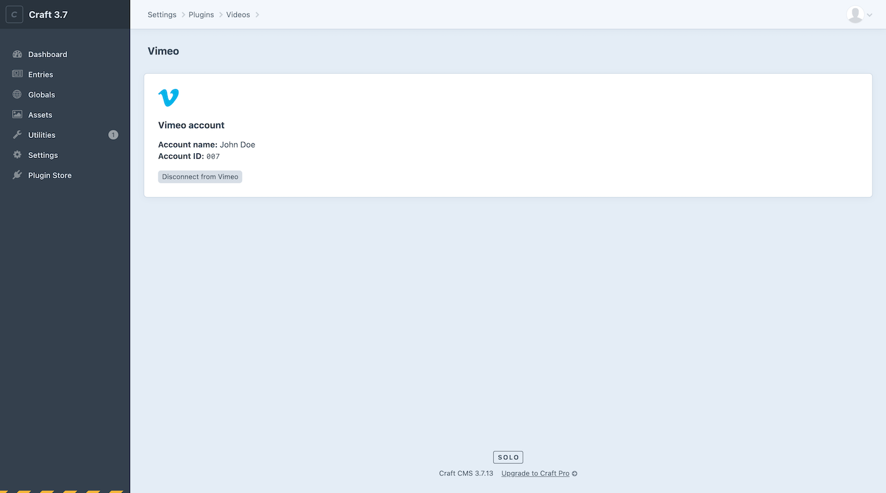

# Connect to Vimeo

- Go to your Craft CMS control panel.
- Navigate to **Settings → Videos → Vimeo**.
- Click on the “OAuth Settings” link.

## 1. Create the Vimeo app

- In another tab of your browser, open the [Vimeo Developer Console](https://developer.vimeo.com/apps).
- Click on the [+ Create an app](https://developer.vimeo.com/apps/new?source=topnav) button located next to the top right corner of the page.
- Choose app name and description.
- Check “__No.__ The only Vimeo accounts that will have access to the app are my own”.
- Accept the agreements.
- Click on “Create App”.

## 2. Configure the OAuth callback URL

When your new app is created:

- Navigate to it **[Vimeo Developer Console](https://developer.vimeo.com/apps) → Your new app**.
- Go to [OAuth Redirect Authentication](https://developer.vimeo.com/apps/231094#oauth_redirect_auth)
- Click on __Add URL +__ button under __Your callback URLs__ section.
- Add the __Redirect URI__ of your “Vimeo OAuth Settings” in Videos plugin settings in the field's modal.

## 3. Configure the OAuth client

- Copy the Client identifier & Client secret of your Vimeo app.
- Go to your Craft CMS control panel.
- Navigate to **Settings → Videos → Vimeo**.
- Click on the “OAuth Settings” link.
- Paste the OAuth client and secret into the corresponding fields and click “Save”.

## 4. Connect to Vimeo

You should now be ready to connect your Craft CMS website to your Vimeo account:

- Go to your Craft CMS control panel.
- Navigate to **Settings → Videos → Vimeo** and click ”Connect to Vimeo.

🎉
