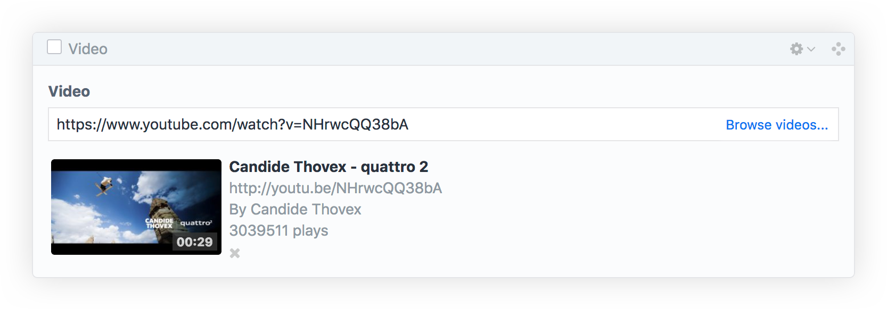

# Video Field

## The Field
The Video field type lets you add videos to your entries. Retrieving video informations is then pretty easy : a video variable is provided which let's you retrieve all the informations related to your video.



## Output

The Video field returns a [Video model](video-model.md) which you can use to access a video’s attributes from your templates.

```twig



    
        <ul>
            <li>title: {{ video.title }}</li>
            <li>url: {{ video.url }}</li>
            <li>embed: {{ video.embed({ width: 300, height: 200 }) }}</li>
        </ul>
    
        <p>Video has errors:</p>
        <ul>
            
                <li>{{ error }}</li>
            
        </ul>
    

    <p>No video.</p>

```